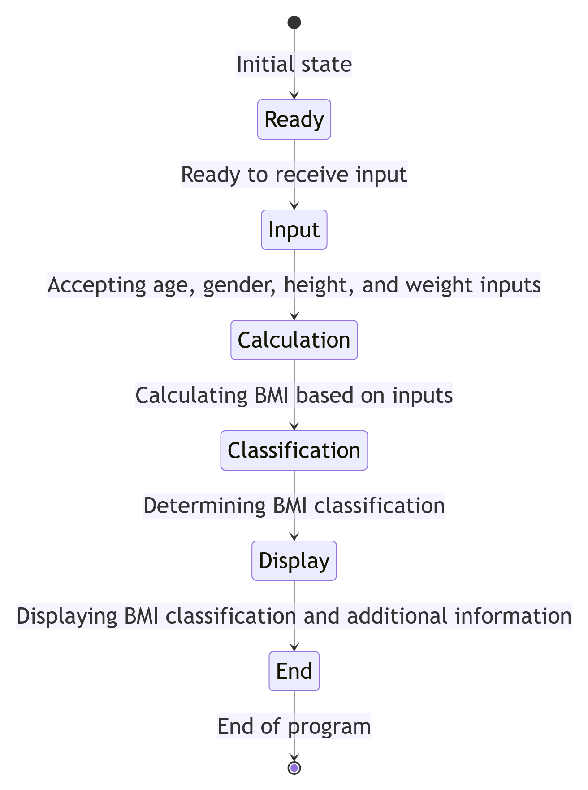

# BMI Calculator

This BMI (Body Mass Index) Calculator is a simple command-line tool that calculates BMI based on user input for weight and height. BMI is a measure of body fat based on height and weight that applies to adult men and women.

## Usage

To use the BMI Calculator, follow these steps:

1. Clone this repository to your local machine.
2. Navigate to the project directory.
3. Compile the source code on terminal or Command Prompt using `gcc src/* -Iinclude -o bmiCalculator`.
4. Run the executable file `./bmiCalculator` to calculate BMI.

## Folder Structure

The project follows the following folder structure:

- `include`: Contains header files (`bmi.h`) for function prototypes and data structures.
- `src`: Contains source code files (`main.c` and `bmi.c`) for the BMI calculator application.

## Data Structures

### userData Struct
- `Age`: User's age in years (uint8_t).
- `Height`: User's height in centimeters (float).
- `Weight`: User's weight in kilograms (float).

### bodyType Struct
- `underWeight`: Character representing underweight body type.
- `normal`: Character representing normal body type.
- `overweight`: Character representing overweight body type.
- `obesity`: Character representing obesity body type.

### obesityType Struct
- `SevereThinness`: BMI range for severe thinness (< 16).
- `ModerateThinness`: BMI range for moderate thinness (16 - 17).
- `MildThinness`: BMI range for mild thinness (17 - 18.5).
- `Normal`: BMI range for normal weight (18.5 - 25).
- `Overweight`: BMI range for overweight (25 - 30).
- `ObeseClassI`: BMI range for obese class I (30 - 35).
- `ObeseClassII`: BMI range for obese class II (35 - 40).
- `ObeseClassIII`: BMI range for obese class III (> 40).

## BMI Classification

| Classification      | BMI Range (kg/m²) |
|---------------------|-------------------|
| Severe Thinness     | < 16              |
| Moderate Thinness   | 16 - 17           |
| Mild Thinness       | 17 - 18.5         |
| Normal              | 18.5 - 25         |
| Overweight          | 25 - 30           |
| Obese Class I       | 30 - 35           |
| Obese Class II      | 35 - 40           |
| Obese Class III     | > 40              |

### Healthy BMI Range and Weight

- Healthy BMI range: 18.5 kg/m² - 25 kg/m²
- Healthy weight for the height: 59.9 kg - 81 kg

### BMI Formula

The BMI formula is calculated differently for the International System of Units (SI) and the US customary system (USC):

- USC Units:
  \[ \text{BMI} = 703 \times \frac{\text{mass (lbs)}}{\text{height² (in)}} \]
  
- SI, Metric Units:
  \[ \text{BMI} = \frac{\text{mass (kg)}}{\text{height² (m)}} \]

### BMI Prime

BMI Prime is the ratio of a person's measured BMI to the upper limit of BMI considered "normal" (BMI upper = 25 kg/m²). The BMI Prime formula is:
\[ \text{BMI Prime} = \frac{\text{BMI}}{25} \]

## Diagrams

### Flow Chart

### State Diagram

### Class Diagram

The flow chart illustrates the logic flow of the BMI calculator application. The state diagram shows the different states of the application during execution. The class diagram outlines the data structures used in the application.

Before coding, use ChatGPT to generate Mermaid code for Flow Chart, State Diagram, and Class Diagram. Paste the Mermaid code into [excalidraw](https://excalidraw.com) to generate the diagrams.

Happy coding and enjoy building your BMI calculator app!
